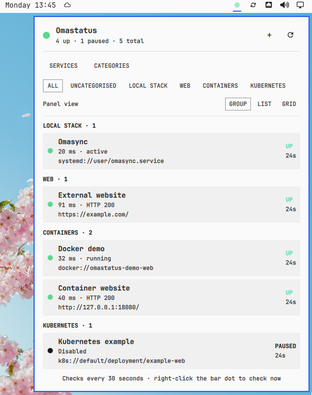
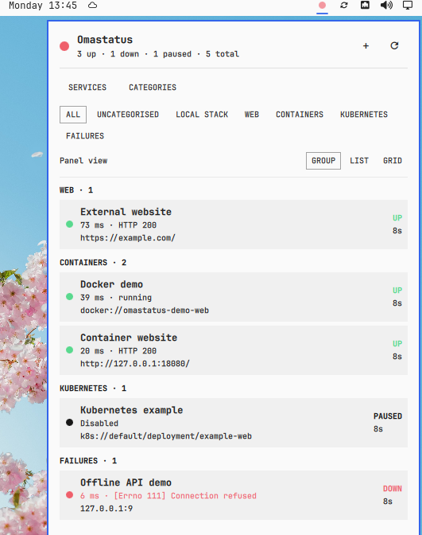
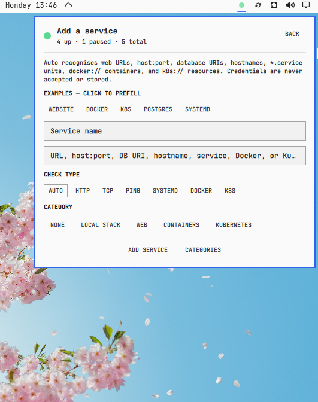
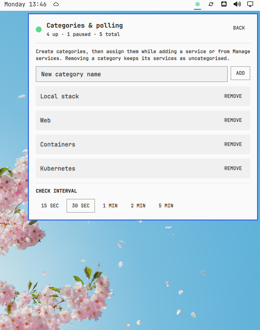

# Omastatus

Omastatus is an independent Omarchy Quattro plugin for watching local and remote services from the bar. A small dot shows the aggregate state: green when every enabled service is up, red as soon as one is down, amber while a check is running or unstable, and grey before anything is configured.

Click the dot to open a native panel with a status dot beside every service.





## Features

- Add, pause, categorise, recategorise, and remove services entirely from the panel.
- Automatic target detection, plus explicit HTTP, TCP, ping, systemd, Docker, and Kubernetes modes.
- Concurrent checks, so ten timeouts do not block one after another.
- Categories with an All/Uncategorised filter.
- Three persistent panel layouts: grouped detail, compact list, and two-column grid.
- Configurable 15-second to 5-minute polling from the panel; the CLI accepts 5 seconds to 1 hour.
- Desktop notifications on a transition to down and on recovery.
- Private, atomic configuration and state files; no cloud account or monitoring server.

## Supported targets

| What | Examples | Check performed |
|---|---|---|
| Website or API | `https://example.com/health` | HTTP 2xx/3xx response |
| Local service | `localhost:3000`, `tcp://127.0.0.1:6379` | TCP connection |
| Database | `postgres://db.local`, `mysql://localhost:3306`, `redis://localhost`, `mongodb://db.local` | TCP connection, with the standard port when omitted |
| Machine | `server.local`, `ping://192.168.1.20` | One ICMP ping |
| System service | `nginx.service`, `systemd://docker.service` | System `systemctl is-active` |
| User service | `systemd://user/my-worker.service` | User `systemctl --user is-active` |
| Docker container | `docker://api`, or `api` with Docker mode selected | Container is running and not unhealthy |
| Kubernetes pod | `k8s://default/pod/api-7c9f` | Pod phase and container readiness |
| Kubernetes workload | `k8s://production/deployment/api`, `k8s://default/statefulset/postgres`, `k8s://monitoring/daemonset/node-exporter` | Ready replicas/nodes versus desired count |
| Kubernetes job | `k8s://default/job/database-migration` | Completed executions versus desired completions |
| Other Kubernetes resource | `k8s://default/service/api` | Resource existence or its Ready/Available condition when exposed |

Database probes intentionally check reachability rather than authenticate. Omastatus rejects usernames and passwords in targets so credentials never land in its JSON configuration.

Docker checks use the local Docker CLI. Kubernetes checks use the current `kubectl` context and store only the namespace/kind/name reference; kubeconfig credentials remain managed by Kubernetes tooling.

## Example monitors

The add screen includes Website, Docker, Kubernetes, PostgreSQL, and systemd presets that prefill the form without creating anything until **Add service** is pressed. A practical setup could contain:

| Category | Name | Target |
|---|---|---|
| Production | Public website | `https://example.com/` |
| Production | API readiness | `https://api.example.com/ready` |
| Local dev | Frontend | `http://localhost:3000` |
| Local dev | PostgreSQL | `postgres://localhost` |
| Containers | API container | `docker://my-api` |
| Kubernetes | API deployment | `k8s://production/deployment/api` |
| Kubernetes | Migration job | `k8s://production/job/migrate-2026-08` |
| Machine | Omasync | `systemd://user/omasync.service` |

The equivalent CLI commands are:

```sh
OMASTATUS="$HOME/.config/omarchy/plugins/io.github.dupontbertrand.omastatus/bin/omastatus"

"$OMASTATUS" add --name "Public website" --target "https://example.com/"
"$OMASTATUS" add --name "API container" --target "docker://my-api"
"$OMASTATUS" add --name "API deployment" --target "k8s://production/deployment/api"
"$OMASTATUS" add --name PostgreSQL --target "postgres://localhost"
"$OMASTATUS" add --name Omasync --target "systemd://user/omasync.service"
```

## Install

```sh
omarchy plugin add https://github.com/dupontbertrand/omastatus --enable --yes
```

For local development, link this checkout and rescan plugins:

```sh
ln -s "$PWD" "$HOME/.config/omarchy/plugins/io.github.dupontbertrand.omastatus"
omarchy-shell shell rescanPlugins
omarchy plugin enable io.github.dupontbertrand.omastatus --section right
```

The plugin creates these files on first load:

```text
~/.config/omastatus/config.json
~/.local/state/omastatus/status.json
```

Both files and their parent directories are user-only. Checks run directly from the Omarchy machine. No target or result is sent anywhere else.

## Panel

Use `+` to add a service. **Auto** is suitable for most targets; choosing a type explicitly gives stricter validation.



The dashboard offers:

- category filters;
- grouped, list, and grid views;
- immediate refresh;
- a service manager for pause, category cycling, and two-step removal;
- category creation/removal and polling presets.

Services can be created entirely from the panel. Presets fill in common Website, Docker, Kubernetes, PostgreSQL, and systemd targets, while the Auto mode recognises supported target formats.

Categories and the polling interval are managed in the same panel.



Right-click or middle-click the bar dot to check every service without opening the panel.

## CLI

The UI invokes the plugin-local CLI; it is also useful for diagnostics:

```sh
OMASTATUS="$HOME/.config/omarchy/plugins/io.github.dupontbertrand.omastatus/bin/omastatus"

"$OMASTATUS" config
"$OMASTATUS" status
"$OMASTATUS" check
"$OMASTATUS" add --name PostgreSQL --target localhost:5432 --type tcp
"$OMASTATUS" add-category "Local dev"
"$OMASTATUS" --help
```

Set `OMASTATUS_CONFIG_DIR` and `OMASTATUS_STATE_DIR` to override the storage paths, notably in tests.

## Dependencies and security

Omastatus uses Python 3 and standard Omarchy/Arch tools: `ping`, `systemctl`, and `omarchy-notification-send`. HTTP and TCP checks use Python's standard library. Docker and Kubernetes checks are optional and activate when their respective `docker` and `kubectl` CLIs are installed.

The checker never invokes a shell with a target. Ping hosts, systemd units, Docker container names, and Kubernetes resource references are validated and passed as separate process arguments. HTTP URLs cannot contain credentials. Like every Omarchy plugin, its QML and local executable run unsandboxed, so inspect the source before enabling it.

## Development

```sh
python3 -m unittest discover -s tests -v
python3 -m py_compile bin/omastatus
omarchy plugin validate .
```

The tests use temporary configuration/state directories and a local ephemeral HTTP server. They do not modify the user's Omastatus data.

MIT licensed.
